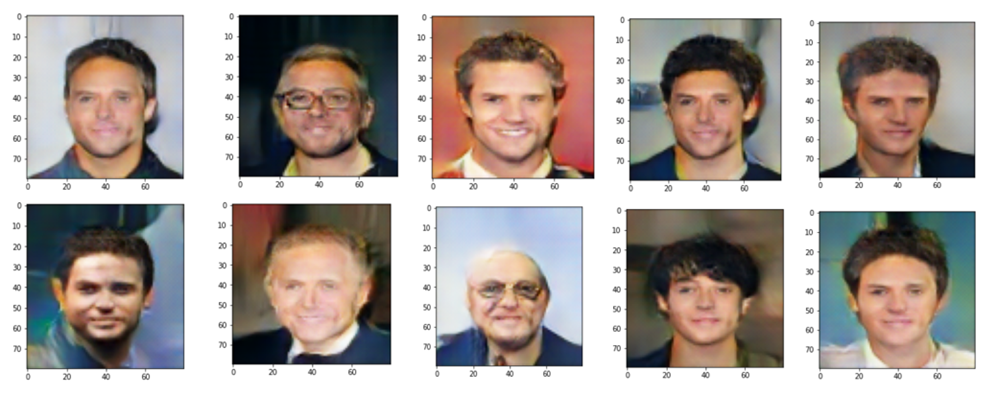
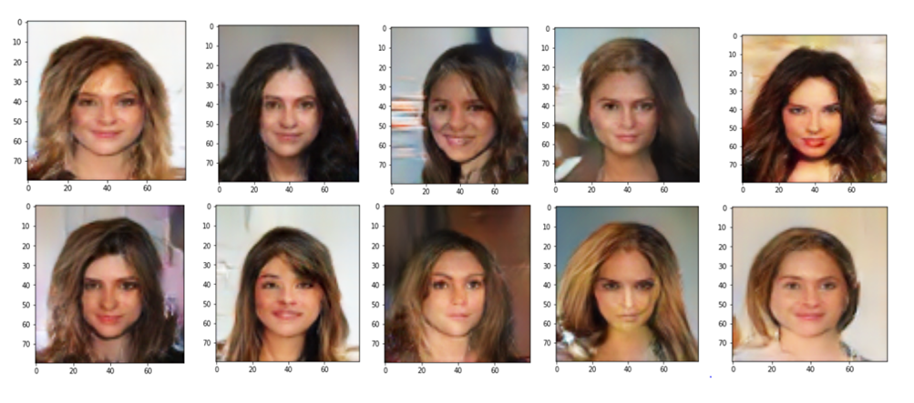
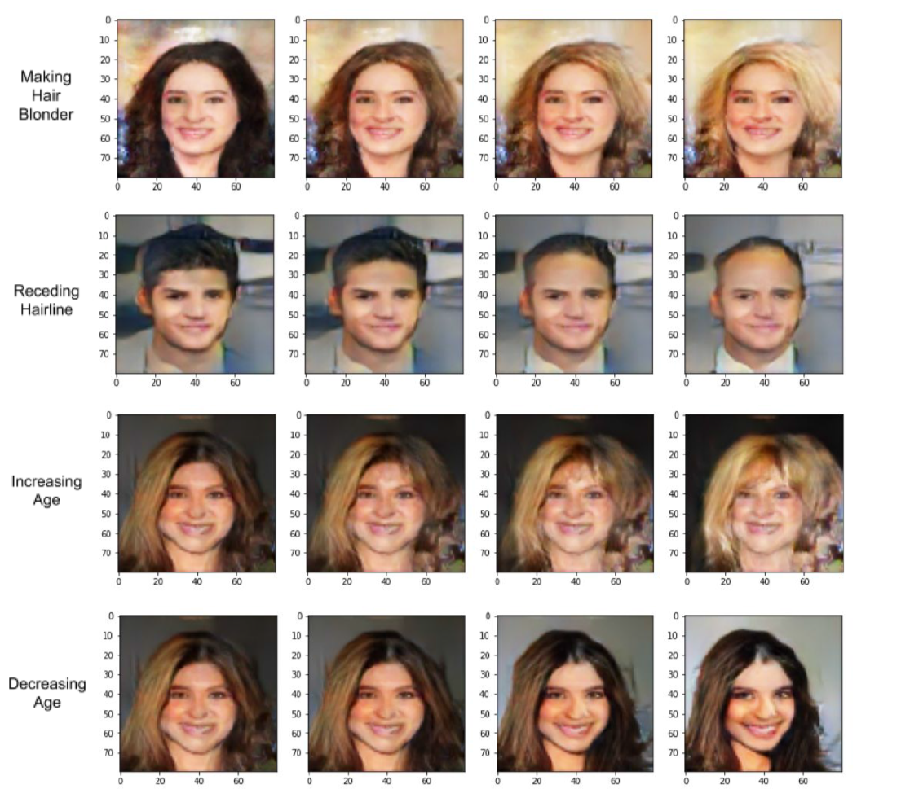
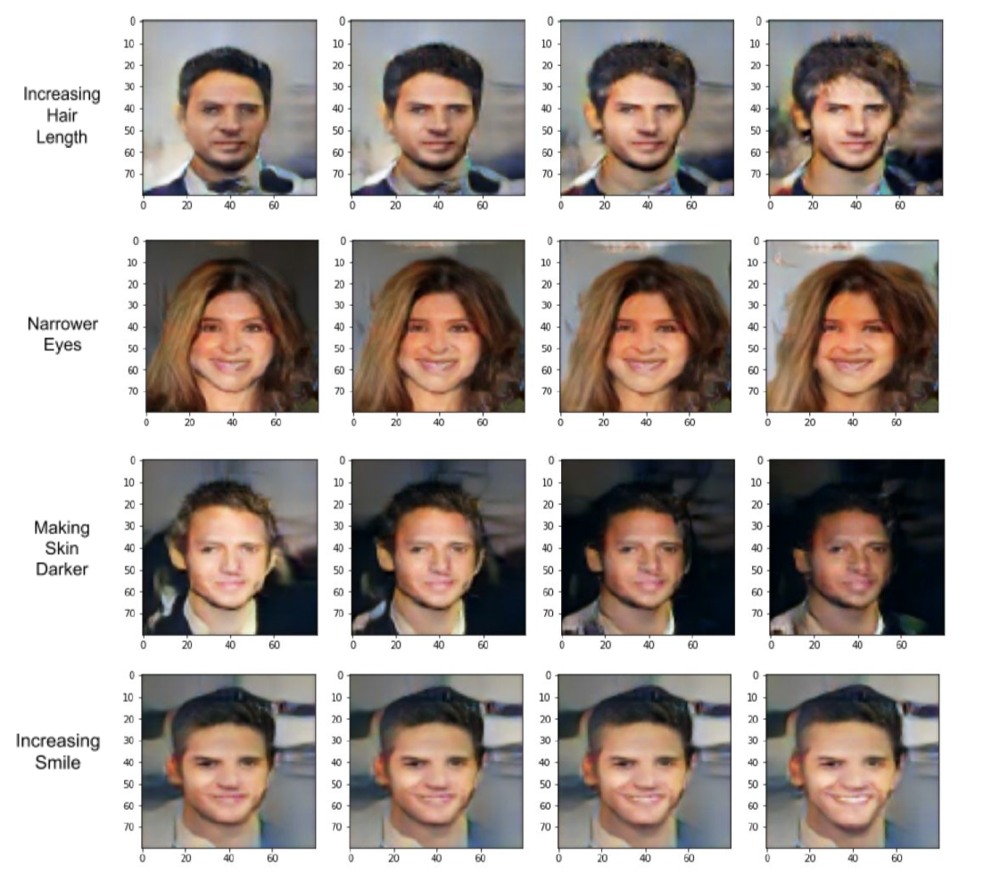

# Sketch4Me

## Problem Description
A good feature based face editing software is an important component of several applications required for solving problems in various fields. One such application scenario is the visualization of a crime suspect described in terms of facial features by an eyewitness. Witnesses’ recollection is usually based on distinct facial features such as color of the hair, face structure, age, skin tone and even shape of the eyes or nose. This description is then translated into a visual by a sketch artist who tries to replicate, to the best of their ability, the given description. In many cases, the process of doing so is highly time consuming and often the end results are not satisfactory. In instances where adjustments need to be made, the artist mostly has to draw a new sketch making the process extremely slow. In an attempt to solve this problem, we have implemented a feature based face editing model called Sketch4Me that can help a modern police force generate a visual portrait of a suspect as described by an eye witness in terms of facial features, almost instantly. The model also allows for customization of various kinds of attributes, and produces results based on these customizations. Not only does this model result in a reduced process time, but it can also produce highly realistic and customized facial images.

## Prior Approaches and Literature Review

A lot of research has been conducted in this field with numerous different methods of implementation. We have listed below, some of the most prominent approaches to solving the problem at hand.
<ol>
<li><b>β-VAE - Learning basic visual concepts with a constrained variational framework</b> 
<em>Irina Higgins, Loic Matthey, Arka Pal, Christopher Burgess, Xavier Glorot, Matthew Botvinick, Shakir Mohamed, Alexander Lerchner</em>  
The approach is a modification of the variational autoencoder (VAE) framework. It is a new state-of-the-art framework for automated discovery of interpretable factorised latent representations from raw image data in a completely unsupervised manner.

<li><b>Generative Adversarial Networks</b> 
<em>Ian J. Goodfellow, Jean Pouget-Abadie, Mehdi Mirza, Bing Xu, David Warde-Farley, Sherjil Ozair, Aaron Courville, Yoshua Bengio</em> 
This framework allows the normally supervised learning approach of neural networks in an unsupervised way.

<li><b>DCGAN</b> 
<em>Alec Radford, Luke Metz, Soumith Chintala</em> 
A class of CNNs called deep convolutional generative adversarial networks (DCGANs) have certain architectural constraints, and demonstrate that they are a strong candidate for unsupervised learning. Training on various image datasets, it shows convincing evidence that the deep convolutional adversarial pair learns a hierarchy of representations from object parts to scenes in both the generator and discriminator. Additionally, it used the learned features for novel tasks - demonstrating their applicability as general image representations.

<li><b>InfoGAN</b> 
<em>Xi Chen</em> 
A research study proposed a GAN-styled neural network which uses information theory to learn “disentangled representations” in an unsupervised manner.They called the resulting neural network as InfoGAN which was a generative adversarial network that “maximised the mutual information between a small subset of the latent variables and the observation”.

<li><b>PGGAN</b> 
<em>Nvidia</em> 
NVIDIA revealed a new technique to train GANs to generate high-quality high-dimension images and they call them Progressive Growing GANs.The approach they used to train the network was by generating 4x4 resolution images initially from generator G and feeding them into discriminator D along with real images, having scaled them to the same resolution for training. When the generator started fooling the discriminator at 4 x 4, the resolution was increased to 8 x 8 in the generator as well as the discriminator, in a phased manner to prevent any abrupt changes in weights. At each stage when the generator got better the image resolution was doubled until the model started generating images of resolution 1024 x 1024. The images NVIDIA’s model generated are probably the highest quality images to have ever been generated using GANs. Some of the images generated using the PGGAN can be found on this <a href="https://thispersondoesnotexist.com">website</a>.

## Adopted Approach
We used Convolution Neural Networks (CNN) , a Generative Adversarial Network (more specifically, a flavour of DCGAN) and a Regression Model to create our overall product. The Generative Adversarial Network was used initially to create images of the utmost achievable quality. The Convolutional Neural Networks were used to create classifiers that could accurately predict the attributes of a generated image, and a set choice of attributes were picked for this process. The linear regression model was used to find a mapping between the different facial features and the latent space. The output of the regression model gave us the slope of the feature axes, and moving along this slope allowed us to generate images with required attributes.

## Implementation Details
### Generative Adversarial Network
The Generative adversarial network was the most important and complex component of our overall model. The first step was to come up with a stable design for the generator and the discriminator. In GANs there is a trade-off between size (number of pixels) and quality of generated images. Trying to increase both drastically increases the training time, and given the limited resources we had (Google Colab) we chose to stick to images of size 80 x 80 px and got results of fairly good quality. This pushed our training time to 10 hours for the GAN model for 200 epochs.  
<b>Dataset:</b> We used the CelebA dataset from Kaggle to train our GAN model. This dataset contains 202,599 face images of various celebrities. We used around 40,000 of these images (due to computing power constraints) to train our GAN model. These images, original of dimensions 178 x 218, were resized to 80 x 80 using the scikit-learn library.  
<b>Discriminator:</b> The job of the discriminator is to tell real images from fake images. We used a sequential model with 5 Convolutional layers interleaved with LeakyReLU layers. Kernel size of (3 x 3) was used initially which was increased to (5 x 5) in the later layers. The discriminator got an input of size 80 x 80, and with each convolutional layer, which had a stride of 2, the size of the image was reduced to 5 x 5. This was followed by the classifying layers; a flatten layer, and 2 dense layers with the final dense layer giving a single floating point number as output (a value between 0 and 1 with 0 denoting fake image and 1 denoting real image). The discriminator was trained with Adam optimizer and Binary Cross Entropy loss.  
<b>Generator:</b> The generator is responsible for producing synthetic/fake images and fooling the discriminator. The generator gets a latent vector of size 100 x 1, which is generated randomly, as input from the latent space. It also gets a vector of the required facial features as input from the user. It then tries to transform the latent vector into an image belonging to the same distribution as that of the training dataset. We used a sequential model for the generator. The input vector is first passed through a dense layer and converted into an image of size 5 x 5. Four Transposed Convolutional layers are then added to the model to upsample the image from 4 x 4 to 80 x 80 in steps. LeakyReLU layers are also added in tandem with the transposed convolutional layers. The final layer of the generator is a simple convolutional layer with tanh activation to produce outputs in the range of [-1,+1] just like the training images. Kernel size of (3 x 3) was used initially which was increased as the size of the image increased with every upsampling layer to (11 x 11) finally. Such a big kernel size helped in smoothening out the facial features, making them look more realistic. Once we get an output image it is passed through our feature detection CNNs (architecture discussed later). The CNNs classify the features. We compare these features with the feature vector we got as input from the user. If we get a match i.e. the vectors are equal, our job is done. Otherwise we generate a new face using a new latent vector.  
<b>Overall GAN model:</b> The GAN model consisted of the generator followed by the discriminator. The generator gets as input a latent vector of dimension 100 x 1, produces an output image of size 80 x 80 which then goes as input into the discriminator and we finally get a single floating point number as output. When training the GAN only the weights of the generator should be updated and hence the weights of the discriminator are made non-trainable. The GAN was trained with Adam optimizer and Binary Cross Entropy loss.  
<b>Results:</b> Initially, the GAN model struggled to generate human-face like structures. However, as it trained for more and more epochs, it gradually started producing better results. The accuracy of the GAN which remained stuck at 0 for the first 30-40 epochs started increasing and ultimately reached close to 0.5 signifying that the generator fooled the discriminator in almost 50% of the cases. This jump in accuracy was reflected in the quality of results we started receiving after the 150th epoch. We have displayed a few images that the GAN model produced after training was completed.  
In the collection below, for the first 3 images of first row the input facial features were as follows: 
<b>Image 1 -</b> Input features were black hair, light skin, short hair, male and young. 
<b>Image 2 -</b> Input features were gray hair, short hair, chubby and receding hairline. 
<b>Image 3 -</b> Input features were blonde hair, light skin, male and smiling. 

In the collection below, for the first 3 images of the first row the input facial features were as follows: 
<b>Image 1 -</b> Input features were blonde hair, high cheekbones, wavy hair and female. 
<b>Image 2 -</b> Input features were black hair, young, slim face and light skin. 
<b>Image 3 -</b> Input features were smiling, long hair and female. 

### Convolutional Neural Network
The job of the CNN in our model is to act as a feature classifier. Our initial approach was to use a single CNN to classify 15-20 facial features such as Male-Female, Black hair-Blond hair, Dark skin-Light skin, Chubby-Skinny etc. However, a single CNN could not classify so many features at once, which was confirmed by viewing the activation maps. The accuracy hovered around 15-20% which wasn’t suitable for the future stages of the model implementation. Hence, we decided to implement a dedicated CNN model for each individual facial feature, ending up with 17 CNN models in total which classified features with high levels of accuracy (85-95%). We have described below how we implemented the CNN models.  
<b>Dataset:</b> The celebA dataset was again used to train the CNN models. The dataset has a CSV file named ‘list_attr_celeba.csv’ which has information about the features for each of the 202,599 images in the dataset. The CSV file has 41 columns. The first column stores the image_id and the next 40 columns have the value +1 or -1 for a particular facial attribute, +1 denoting that the image with that image_id has that attribute and -1 denoting it doesn’t. For training the CNN for a particular feature, say Skin_Tone, we picked up 5000 images with the value +1 in the Skin_Tone column and 5000 images with the value -1 in the Skin_Tone column. These labels were as such not suitable for our model. Hence, we one-hot encoded them to make classification easier. +1 became (1 0) and -1 became (0 1). The model was then trained on these 10,000 images and the respective label values.  
<b>Model Structure:</b> We defined a simple CNN which took as input images of size 80 x 80 and output 2 floating point values (it is important to note that the label values were one-hot encoded and hence we got 2 output values and not 1 for each feature label). The CNN was a sequential model with 5 Conv2D layers which reduced the image size to 5 x 5. A BatchNormalization layer was also added after each Conv2D layer to normalize the activations of the previous layer. The classifier consisted of one flatten and 4 Dense layers. The final Dense layer used a softmax activation function for classification and output 2 floating point values (probabilities). The model was compiled with Adam optimizer and Categorical Crossentropy loss.  
<b>Results:</b> The CNN models produced final accuracies in the range of 85-95% for the 17 chosen facial features. These accuracies were good enough to be used in our Regression model.  
  
### Regression Model
The  Regression model was the final model in our project bringing together the GAN and the CNNs. It used the outputs from our previous models to create a relationship between the latent vectors and feature labels. We performed regression between the latent vectors and feature predictions from our CNN, the slope of which gave us the feature axes. Moving along the feature axes helped us control the required feature in an image and we could produce images with a certain attribute. The overall procedure is explained below.  
<b>Input Data:</b> We generated a large number of latent points, around 30,000, and stored them in an array. This array was sent as input into our GAN model, where we generated images from these latent points. The images generated from the GAN were then sent as input into the CNNs. We saved the corresponding values of feature label predictions that we got as output from our CNNs. Note that the CNNs give two floating point outputs. We took the higher one of them. If the first output was higher it was taken as such and if the second one was higher its negative value was taken. This was done to maintain consistency with the initial label values (before one-hot encoding).  
<b>Regression:</b> We used an ordinary least squares linear regression model for finding the slope (i.e the feature axes). The regression model had as inputs, the latent points and the feature labels for images corresponding to those latent points. We allowed for a tanh representation of the input values which accommodated the same range [-1,+1] as our feature labels and latent points. Since it is differentiable it allows for the slope to be calculated. LinearRegression fits a linear model with coefficients w = (w1, …, wp) to minimize the residual sum of squares between the observed targets in the dataset, and the targets predicted by the linear approximation. Once the model was fit using our latent points and feature labels, we received the feature axes. Once we received the feature slope or axis for some attribute, we could move in the direction of a unit vector corresponding to that attribute (i.e. by adding the feature slope value corresponding to that attribute to the latent points) and the output i.e. the new image produced would be modified with respect to that attribute. For example, if we moved a unit in the direction of the beard feature in our feature axes, the output image will have a more defined presence of a beard. This movement along the feature axes affected the generated images in a manner to produce an image with required attributes.

## Final Results
After combining all of our models together, namely the GAN, CNNs and Linear Regression model, we were able to create the final feature based face editing software. It is a menu-driven software which allows users to make changes to particular features, in steps. Changes can be made in both the positive and negative direction i.e. for the feature age the generated person can be made older or younger by moving in opposite directions. Some of the results we obtained from our model have been presented below. 

